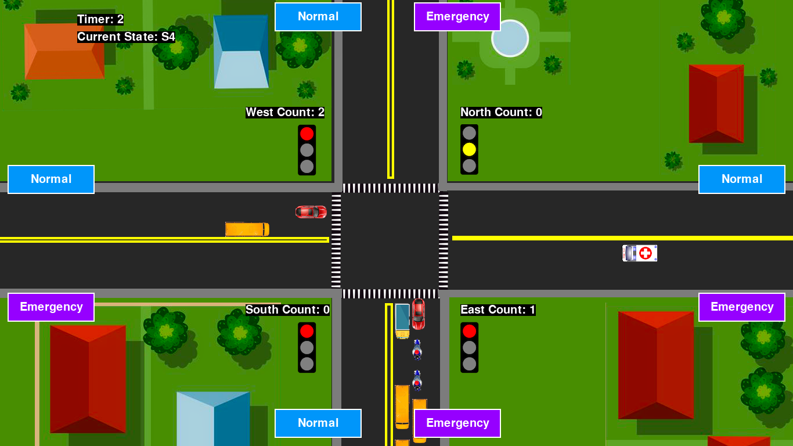

# TrafficSync  
**Simulating Traffic Dynamics through Finite State Automata with Flow Optimization and Emergency Vehicle Priority**

---

## 📖 Project Overview  
TrafficSync is a traffic flow simulator designed for a **four-way intersection**, developed using **Pygame**.  
The system is modeled using a **Moore Machine (Finite State Automaton)** to represent the state transitions of traffic lights and integrate features such as:  

- **Traffic Flow Optimization** (lane vehicle counting)  
- **Emergency Vehicle Prioritization** (dynamic prioritization of emergency vehicles)  
- **Graphical Simulation** (visual representation of intersection, vehicles, and traffic lights)  

This project extends the idea of traffic light FSMs by coupling them with vehicle generation, emergency handling, and real-time intersection dynamics.

---

## 🚦 Features  
- **Finite State Machine (FSM) for Traffic Lights**  
  - Moore machine implementation to handle East-West and North-South light cycles.  
- **Traffic Flow Optimization**  
  - Lane counters track the number of vehicles in each lane to optimize green light durations.  
- **Emergency Vehicle Priority**  
  - Emergency detector ensures vehicles like ambulances get immediate right-of-way.  
- **Vehicle Generation**  
  - Buttons for generating both **normal vehicles** and **emergency vehicles**.  
- **User Interface (UI)**  
  - Visual 4-way intersection with traffic lights, road markings, and animated vehicle sprites.  

---

## 🎮 How It Works  
1. Run `simulation.py` to launch the simulation.  
2. Use the on-screen buttons to spawn **normal** or **emergency** vehicles.  
3. Vehicles are placed in lanes and controlled by the FSM traffic lights.  
4. Lane counters optimize light switching.  
5. Emergency vehicles trigger priority handling, overriding normal flow.  

---

## 📸 Screenshots  

---

## 📚 Scope & Limitations  
- **Scope**:  
  - Simulates a simplified four-way intersection with finite automata.  
  - Implements flow optimization and emergency vehicle priority.  
  - Provides a visual and interactive traffic simulation using Pygame.  

- **Limitations**:  
  - Pedestrian traffic and different vehicle types are not modeled.  
  - Assumes static road conditions.  
  - Simulation accuracy depends on the FSM logic and prioritization system.  
  - Limited by **Pygame’s 2D graphics** and may not reflect real-world traffic complexities.  

---

## 🔗 References  
This project’s GUI and Pygame structure are **adapted from** [Basic-Traffic-Intersection-Simulation](https://github.com/mihir-m-gandhi/Basic-Traffic-Intersection-Simulation) by Mihir Gandhi.  
TrafficSync extends the original idea by introducing **finite state automata**, **vehicle priority handling**, and **traffic flow optimization**.  

---

